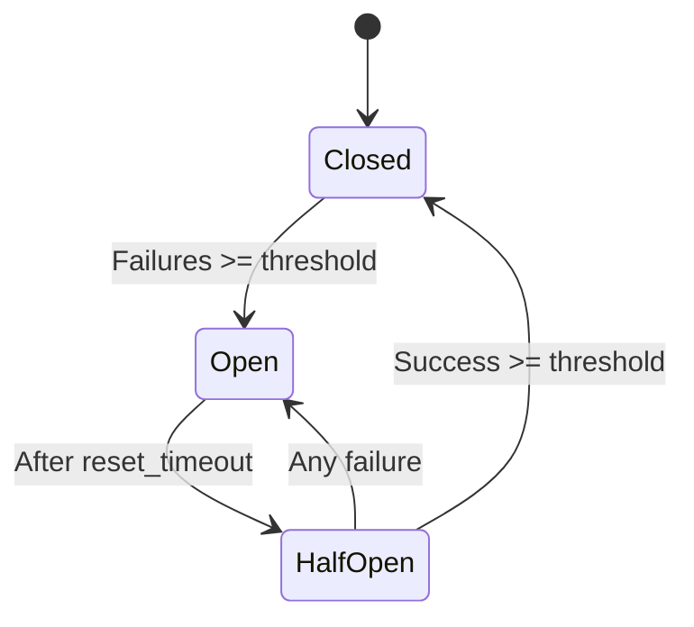

Everruns includes a custom **durable execution engine** built entirely on PostgreSQL. It provides workflow orchestration, automatic retries, circuit breakers, and distributed task execution without external dependencies.

## Architecture

The durable engine is implemented in the `everruns-durable` crate and provides:

- **Event-sourced workflows** — Deterministic state machines driven by events
- **PostgreSQL-backed persistence** — No additional infrastructure required
- **Distributed task claiming** — Scalable to 1000+ concurrent workers
- **Push-based notifications** — Low-latency task distribution (&lt;10ms P99)
- **Reliability primitives** — Retries, circuit breakers, timeouts, dead letter queues

```
┌──────────────────────────────────────────────────────────────┐
│                        everruns-durable                              │
├──────────────────────────────────────────────────────────────┤
│  Workflow Engine    Activity Executor    Worker Pool    Scheduler   │
├──────────────────────────────────────────────────────────────┤
│                   WorkflowEventStore (PostgreSQL)                    │
│  - durable_workflow_instances     - durable_task_queue              │
│  - durable_workflow_events        - durable_workers                 │
│  - durable_circuit_breaker_state  - durable_signals                 │
├──────────────────────────────────────────────────────────────┤
│  Reliability: RetryPolicy, CircuitBreaker, TimeoutManager, DLQ      │
├──────────────────────────────────────────────────────────────┤
│  Observability: OTel Tracing, Metrics, Admin API                   │
└──────────────────────────────────────────────────────────────┘
```

<Note>
The durable engine is **self-contained** — no Temporal, Cadence, or other external workflow systems required.
</Note>

## Core Abstractions

### Workflow

A deterministic state machine driven by events:

- **Input/Output types** — Serializable data structures
- **Event handlers** — `on_start`, `on_activity_completed`, `on_activity_failed`, `on_timer_fired`, `on_signal`
- **Actions** — Return `WorkflowAction` to schedule activities, timers, or complete

**Example workflow:**

```rust
struct AgentTurnWorkflow;

impl Workflow for AgentTurnWorkflow {
    type Input = TurnRequest;
    type Output = TurnResult;

    async fn on_start(&self, input: Self::Input) -> WorkflowAction {
        // Schedule input activity
        WorkflowAction::ScheduleActivity {
            activity_type: "input".to_string(),
            input: serde_json::to_value(input).unwrap(),
            retry_policy: RetryPolicy::default(),
        }
    }

    async fn on_activity_completed(
        &self,
        activity_type: &str,
        result: serde_json::Value,
    ) -> WorkflowAction {
        match activity_type {
            "input" => {
                // Schedule reason activity
                WorkflowAction::ScheduleActivity {
                    activity_type: "reason".to_string(),
                    input: result,
                    retry_policy: RetryPolicy::default(),
                }
            }
            "reason" => {
                // Schedule act activity or complete
                let has_tools = result["tool_calls"].as_array().map_or(false, |t| !t.is_empty());
                if has_tools {
                    WorkflowAction::ScheduleActivity {
                        activity_type: "act".to_string(),
                        input: result,
                        retry_policy: RetryPolicy::default(),
                    }
                } else {
                    WorkflowAction::CompleteWorkflow { result }
                }
            }
            "act" => {
                // Loop back to reason
                WorkflowAction::ScheduleActivity {
                    activity_type: "reason".to_string(),
                    input: result,
                    retry_policy: RetryPolicy::default(),
                }
            }
            _ => WorkflowAction::FailWorkflow {
                error: format!("Unknown activity: {}", activity_type),
            },
        }
    }
}
```

### WorkflowAction

Actions a workflow can request:

| Action | Description |
|--------|-------------|
| `ScheduleActivity` | Queue activity with retry policy, timeouts, priority |
| `StartTimer` | Delayed execution (future feature) |
| `CompleteWorkflow` | Terminal success state |
| `FailWorkflow` | Terminal failure state |
| `ScheduleChildWorkflow` | Nested workflows (future feature) |
| `CancelActivity` | Cancel pending work (future feature) |

### Activity

A unit of work that may fail and be retried:

```rust
#[async_trait]
pub trait Activity: Send + Sync {
    type Input: DeserializeOwned + Send + Sync;
    type Output: Serialize + Send + Sync;

    async fn execute(
        &self,
        input: Self::Input,
        ctx: ActivityContext,
    ) -> Result<Self::Output, Error>;
}
```

**ActivityContext** provides:

- `attempt` — Current attempt number (1-based)
- `heartbeat()` — Liveness signal for long-running tasks
- `is_cancelled()` — Check if task was cancelled

**Example activity:**

```rust
struct ReasonActivity;

#[async_trait]
impl Activity for ReasonActivity {
    type Input = ReasonInput;
    type Output = ReasonOutput;

    async fn execute(
        &self,
        input: Self::Input,
        ctx: ActivityContext,
    ) -> Result<Self::Output, Error> {
        // Call LLM
        let response = llm_driver.generate(input.messages).await?;
        
        // Heartbeat for long operations
        ctx.heartbeat().await?;
        
        Ok(ReasonOutput {
            content: response.content,
            tool_calls: response.tool_calls,
        })
    }
}
```

### WorkflowSignal

External signals to running workflows:

- `cancel` — Graceful cancellation
- `shutdown` — Immediate stop
- Custom signals for workflow-specific events

Signals are queued in `durable_signals` table and delivered to workflows.

## Persistence

All tables prefixed with `durable_` to avoid conflicts:

### durable_workflow_instances

Workflow state:

```sql
CREATE TABLE durable_workflow_instances (
    id UUID PRIMARY KEY DEFAULT uuidv7(),
    workflow_type TEXT NOT NULL,
    status TEXT NOT NULL,  -- running | completed | failed | cancelled
    input JSONB NOT NULL,
    result JSONB,
    error TEXT,
    created_at TIMESTAMPTZ DEFAULT NOW(),
    completed_at TIMESTAMPTZ
);
```

### durable_workflow_events

Append-only event log for replay:

```sql
CREATE TABLE durable_workflow_events (
    id UUID PRIMARY KEY DEFAULT uuidv7(),
    workflow_id UUID NOT NULL REFERENCES durable_workflow_instances(id),
    sequence_number INTEGER NOT NULL,
    event_type TEXT NOT NULL,
    event_data JSONB NOT NULL,
    created_at TIMESTAMPTZ DEFAULT NOW()
);
```

Event types:

- `workflow.started`
- `activity.scheduled`
- `activity.completed`
- `activity.failed`
- `workflow.completed`
- `workflow.failed`

### durable_task_queue

Activity scheduling with claiming:

```sql
CREATE TABLE durable_task_queue (
    id UUID PRIMARY KEY DEFAULT uuidv7(),
    workflow_id UUID NOT NULL REFERENCES durable_workflow_instances(id),
    activity_type TEXT NOT NULL,
    input JSONB NOT NULL,
    status TEXT NOT NULL,  -- pending | claimed | completed | failed
    claimed_by TEXT,
    claimed_at TIMESTAMPTZ,
    completed_at TIMESTAMPTZ,
    error TEXT
);
```

**Indexes:**

- Partial index on `status = 'pending'` for fast claiming
- Index on `activity_type` for partitioned claiming

### durable_workers

Worker registry for monitoring:

```sql
CREATE TABLE durable_workers (
    worker_id TEXT PRIMARY KEY,
    status TEXT NOT NULL,  -- active | stopped
    last_heartbeat TIMESTAMPTZ DEFAULT NOW(),
    concurrency INTEGER NOT NULL,
    registered_at TIMESTAMPTZ DEFAULT NOW()
);
```

## Task Distribution

### Claiming Strategy

Critical for scalability at 1000+ workers:

```sql
-- Workers don't block each other
SELECT * FROM durable_task_queue
WHERE status = 'pending'
  AND activity_type = $1
ORDER BY id
LIMIT $batch_size
FOR UPDATE SKIP LOCKED;
```

**Optimizations:**

- `SKIP LOCKED` — Workers don't wait for each other
- Partition by `activity_type` — Reduces row scanning
- Batch claiming — Fewer round trips (default: 10 tasks per claim)
- Partial index on `status = 'pending'` — Smaller index scan

### Push-Based Notifications

Low-latency task distribution via PostgreSQL NOTIFY:

```sql
-- Trigger fires on task INSERT
CREATE TRIGGER notify_task_available
AFTER INSERT ON durable_task_queue
FOR EACH ROW
WHEN (NEW.status = 'pending')
EXECUTE FUNCTION notify_task_available();

-- Function sends notification
CREATE FUNCTION notify_task_available() RETURNS TRIGGER AS $$
BEGIN
    PERFORM pg_notify('task_available', NEW.activity_type);
    RETURN NEW;
END;
$$ LANGUAGE plpgsql;
```

**Architecture:**

1. **Control plane** listens on `task_available` channel via `PgListener`
2. **Workers subscribe** to `SubscribeTaskNotifications` gRPC stream
3. **Broadcaster** pushes notifications from PostgreSQL to workers
4. **Fallback** — Workers poll every 10s if stream disconnects

**Latency improvement:**

- Polling (100ms interval): P50=~100ms, P99=~110ms
- Push notifications: P50=~4ms, P99=~10ms (**96% improvement**)

<Tip>
Push notifications reduce task pickup latency by 96% compared to polling.
</Tip>

## Reliability

### RetryPolicy

Exponential backoff with jitter:

```rust
pub struct RetryPolicy {
    pub max_attempts: u32,           // Default: 3
    pub initial_interval: Duration,  // Default: 1s
    pub max_interval: Duration,      // Default: 60s
    pub backoff_coefficient: f64,    // Default: 2.0
    pub jitter: f64,                 // Default: 0.2 (20%)
    pub non_retryable_errors: Vec<String>,
}
```

**Retry delay calculation:**

```rust
let base_delay = initial_interval * backoff_coefficient.powi(attempt - 1);
let capped_delay = base_delay.min(max_interval);
let jittered_delay = capped_delay * (1.0 + rand(-jitter, jitter));
```

**Example progression (1s initial, 2.0 coefficient, 20% jitter):**

- Attempt 1: 1s ± 0.2s
- Attempt 2: 2s ± 0.4s
- Attempt 3: 4s ± 0.8s

### CircuitBreaker

Distributed state via database:



**Configuration:**

```rust
pub struct CircuitBreakerConfig {
    pub failure_threshold: u32,  // Default: 5
    pub success_threshold: u32,  // Default: 2
    pub reset_timeout: Duration, // Default: 60s
}
```

**State stored in `durable_circuit_breaker_state` table** — shared across workers.

### Timeouts

| Timeout | Description | Default |
|---------|-------------|----------|
| `schedule_to_start_timeout` | Max wait in queue | 5 minutes |
| `start_to_close_timeout` | Max execution time | 10 minutes |
| `heartbeat_timeout` | Liveness detection | 30 seconds |

**Heartbeat mechanism:**

```rust
// In activity
loop {
    // Do work...
    
    // Send heartbeat every 10s
    ctx.heartbeat().await?;
    
    // Check for cancellation
    if ctx.is_cancelled() {
        return Err(Error::Cancelled);
    }
}
```

If heartbeats stop (worker crash), control plane reclaims task after 30s.

### Dead Letter Queue

Failed tasks after retry exhaustion:

```sql
CREATE TABLE durable_dead_letter_queue (
    id UUID PRIMARY KEY DEFAULT uuidv7(),
    workflow_id UUID NOT NULL,
    activity_type TEXT NOT NULL,
    input JSONB NOT NULL,
    error TEXT NOT NULL,
    attempts INTEGER NOT NULL,
    failed_at TIMESTAMPTZ DEFAULT NOW()
);
```

DLQ entries can be:

- Investigated for debugging
- Replayed after fixes
- Manually completed/discarded

## Backpressure

Workers report load status in heartbeats:

### Worker-Side

High/low watermarks based on load ratio:

```rust
let load_ratio = active_tasks as f64 / max_concurrency as f64;
let accepting_tasks = load_ratio < 0.9;  // Stop accepting at 90%
```

### System-Wide

Queue depth relative to total capacity:

```rust
let total_capacity = workers.iter().map(|w| w.concurrency).sum();
let load_percentage = (pending_tasks as f64 / total_capacity as f64) * 100.0;

if load_percentage > 80.0 {
    // System under pressure
}
```

Control plane uses load metrics to:

- Reject new workflows (503 Service Unavailable)
- Emit alerts
- Trigger auto-scaling (future)

## Observability

### OpenTelemetry Integration

Spans for workflows and activities:

```rust
// Workflow span
let span = span!(
    Level::INFO,
    "durable.workflow",
    workflow.type = workflow_type,
    workflow.id = %workflow_id,
);

// Activity span
let span = span!(
    Level::INFO,
    "durable.activity",
    activity.type = activity_type,
    activity.attempt = attempt,
);
```

**Semantic conventions:**

- `durable.workflow.*` — Workflow operations
- `durable.activity.*` — Activity execution
- `durable.worker.*` — Worker lifecycle

### Metrics Dashboard

Real-time metrics via SSE streaming:

1. **Workflow Status** — Running + pending (stacked area), completed/failed rate (lines)
2. **Task Status** — Pending + claimed (stacked area), completed/failed rate (lines)
3. **Throughput** — Completed/failed tasks per interval (delta rates)
4. **System Load** — Load % (left axis), workers + DLQ size (right axis)

**Architecture:**

- Background task samples `SystemHealth` every 10s
- Stores in `VecDeque<MetricsPoint>` ring buffer (max 360 = 1 hour)
- Exposed via SSE `snapshot` events and `GET /v1/durable/metrics/timeseries`
- UI renders last 15 minutes with recharts

**MetricsPoint fields:**

```rust
pub struct MetricsPoint {
    pub timestamp: DateTime<Utc>,
    // Gauges
    pub running_workflows: u64,
    pub pending_workflows: u64,
    pub pending_tasks: u64,
    pub claimed_tasks: u64,
    pub active_workers: u64,
    pub load_percentage: f64,
    pub dlq_size: u64,
    // Cumulative totals (for delta rates)
    pub tasks_completed_total: u64,
    pub tasks_failed_total: u64,
    pub workflows_completed_total: u64,
    pub workflows_failed_total: u64,
}
```

### Admin API

```bash
# List active workers
GET /v1/durable/workers

# Get workflow status
GET /v1/durable/workflows/{workflow_id}

# List DLQ entries
GET /v1/durable/dlq

# Metrics time series
GET /v1/durable/metrics/timeseries
```

## Worker Communication

Workers communicate with control plane **exclusively via gRPC**:

### gRPC Operations

| Operation | Description |
|-----------|-------------|
| `ClaimDurableTasks` | Poll for pending tasks |
| `CompleteDurableTask` | Report task success |
| `FailDurableTask` | Report task failure |
| `HeartbeatDurableTask` | Liveness signal |
| `CreateDurableWorkflow` | Start workflow |
| `GetDurableWorkflowStatus` | Check workflow state |
| `SubscribeTaskNotifications` | Push notifications (streaming) |

### Authentication (TM-DURABLE-002)

**Bearer Token** (required in production):

```bash
WORKER_GRPC_AUTH_TOKEN=secret-token-here
```

Server panics if unset in production.

**Mutual TLS** (optional):

```bash
WORKER_GRPC_TLS_CA_CERT=/path/to/ca.pem
WORKER_GRPC_TLS_CERT=/path/to/worker-cert.pem
WORKER_GRPC_TLS_KEY=/path/to/worker-key.pem
```

Provides transport encryption + mutual identity verification.

<Note>
Workers are intentionally **cross-org** — they process tasks from any organization's queue. Org-scoping is enforced at the HTTP API layer.
</Note>

### Startup Retry

Workers retry control plane connection for up to 5 seconds:

```rust
let backoff = ExponentialBackoff {
    initial_interval: Duration::from_millis(100),
    max_interval: Duration::from_secs(1),
    max_elapsed_time: Some(Duration::from_secs(5)),
    ..Default::default()
};
```

Handles startup race conditions when both services restart simultaneously.

## Worker Heartbeat & Stale Detection

Workers send heartbeats every 5 seconds. The `WORKER_HEARTBEAT_TIMEOUT_SECS` constant (60s) is the single source of truth:

**Stale worker detection:**

- `get_system_health` — Only counts workers with heartbeat within 60s as active
- `list_workers` — Only returns workers with fresh heartbeats
- `reclaim_stale_tasks` — Marks workers with stale heartbeats as `stopped`, reclaims their tasks

**Stale task reclaim flow:**

1. Worker crashes without calling `deregister_worker`
2. Heartbeats stop
3. After 60s, control plane marks worker as `stopped`
4. Tasks claimed by that worker are re-queued as `pending`
5. Other workers can claim and execute them

<Tip>
Works in both dev mode (in-memory) and full mode (PostgreSQL).
</Tip>

## Benchmarks

Load tests validate performance and scalability:

### In-Memory Benchmarks

Fast iteration without database overhead:

```bash
just durable-bench
```

- `concurrent_workers` — Task claiming at various worker counts
- `workflow_throughput` — Multi-step workflow execution
- `cold_start_latency` — Enqueue to pickup latency

### PostgreSQL Benchmarks

Real database performance:

```bash
just durable-bench-db  # Auto-starts Docker
```

- `db_concurrent_workers` — Task claiming with real PostgreSQL
- `db_workflow_throughput` — Multi-step workflows with persistence
- `db_cold_start_latency` — Polling vs push notification latency

### Checkpointing

Save results for historical comparison:

```bash
just durable-bench --save
just durable-bench-db --save ci-4cpu-8gb
```

Checkpoints stored in `crates/durable/benches/checkpoints/`.

## Best Practices

### Workflow Design

1. **Keep workflows deterministic** — Same input always produces same event sequence
2. **Use activities for side effects** — LLM calls, database writes, HTTP requests
3. **Handle failures gracefully** — Implement retry policies and fallbacks
4. **Avoid long-running activities** — Use heartbeats, consider splitting

### Activity Implementation

1. **Idempotent operations** — Activities may be retried
2. **Heartbeat for long tasks** — Send heartbeats every 10s
3. **Check cancellation** — Respect `ctx.is_cancelled()`
4. **Structured errors** — Use error types for retry decisions

### Retry Policies

```rust
// Aggressive retries for transient errors
RetryPolicy {
    max_attempts: 5,
    initial_interval: Duration::from_millis(500),
    max_interval: Duration::from_secs(30),
    backoff_coefficient: 2.0,
    jitter: 0.2,
    non_retryable_errors: vec!["InvalidInput".to_string()],
}

// Conservative retries for expensive operations
RetryPolicy {
    max_attempts: 3,
    initial_interval: Duration::from_secs(2),
    max_interval: Duration::from_secs(60),
    backoff_coefficient: 2.0,
    jitter: 0.2,
    non_retryable_errors: vec![],
}
```

### Monitoring

1. **Track DLQ size** — Alert when DLQ entries accumulate
2. **Monitor load percentage** — Scale workers when load > 80%
3. **Watch task latency** — P99 latency indicates worker saturation
4. **Circuit breaker state** — Alert when circuits open

## Next Steps

<CardGroup cols={2}>
  <Card title="Architecture Overview" icon="diagram-project" href="/concepts/overview">
    Understand the overall system architecture
  </Card>
  <Card title="Sessions" icon="comments" href="/concepts/sessions">
    Learn about session execution
  </Card>
  <Card title="Scheduled Tasks" icon="clock" href="/concepts/scheduled-tasks">
    Create cron-based scheduled tasks
  </Card>
  <Card title="Durable API" icon="code" href="/api-reference/durable/workflows">
    API reference for workflow management
  </Card>
</CardGroup>