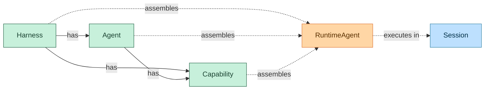
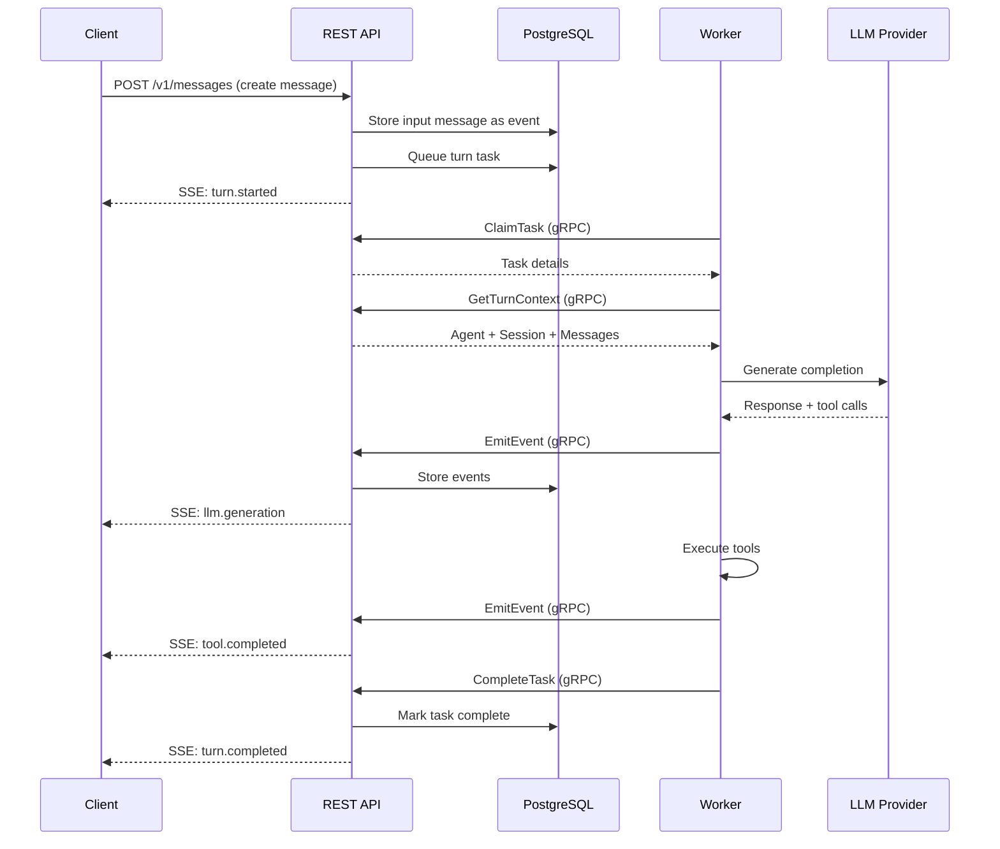

Everruns is a **durable agentic harness engine** built on Rust with a PostgreSQL-backed durable execution system. It provides a modular architecture for building, deploying, and managing AI agents with production-grade durability and observability.

## Core Architecture

The system is organized into three distinct layers that work together to provide flexible, durable agent execution:



**Solid arrows** represent configuration ownership — Harnesses and Agents contain Capabilities.

**Dashed arrows** represent runtime assembly — configuration merges into a RuntimeAgent, which executes in a Session.

## System Components

### Control Plane (Server)

The control plane manages system state and provides APIs:

- **REST API** (port 9000) — Public HTTP API for agent management, sessions, and streaming events
- **gRPC Server** (port 9001) — Internal service for worker communication
- **PostgreSQL Storage** — All persistent state (agents, sessions, events, workflows)
- **SSE Streaming** — Real-time event delivery to clients

### Workers

Stateless executors that process agent turns:

- Communicate exclusively via gRPC (no direct database access)
- Execute the reason-act loop (LLM calls + tool execution)
- Support horizontal scaling with push-based task distribution
- Automatic failover via heartbeat monitoring

### Durable Execution Engine

PostgreSQL-backed workflow orchestration:

- Event-sourced workflows with automatic retries
- Circuit breakers and dead letter queues
- Distributed task claiming via `SKIP LOCKED`
- Push notifications for low-latency task distribution (&lt;10ms P99)

<Tip>
Workers can be deployed separately from the control plane, enabling flexible scaling and resource allocation.
</Tip>

## Configuration Hierarchy

Everruns uses a three-tier configuration model:

1. **Harness** — Infrastructure and base behavior
2. **Agent** — Domain-specific customization (optional)
3. **Session** — Runtime overrides (optional)

Each tier can contribute:

- System prompt additions
- Enabled capabilities
- LLM model selection (overridable at each level)

### Prompt Layering

System prompts are composed in a specific order:

```
[Session Capabilities]
[Agent Capabilities]
[Agent System Prompt]
[Harness Capabilities]
[Harness System Prompt]
```

Capabilities are resolved first, then prompts are prepended in reverse order, with session-level taking highest priority.

<Note>
All prompt sections are wrapped in XML tags for clear boundaries. See the [XML Prompt Formatting spec](https://github.com/everruns/everruns/blob/main/specs/xml-prompt-formatting.md) for details.
</Note>

## Data Flow

A typical agent execution follows this flow:



### Event Streaming

All conversation data is stored as an append-only event log. Messages are reconstructed from events at read time:

- **Events** are the source of truth (immutable, sequenced)
- **Messages** are derived views (not stored separately)
- **SSE** delivers events in real-time to connected clients

## Development Modes

Everruns supports two deployment modes:

### DEV_MODE (In-Memory)

```bash
DEV_MODE=true cargo run -p everruns-server
```

- No PostgreSQL required
- In-process execution (no separate workers)
- Data lost on restart
- Ideal for rapid development and testing

### Full Mode (Production)

```bash
just start-all  # Starts PostgreSQL + server + worker
```

- PostgreSQL-backed persistence
- Separate worker processes
- Durable workflows and events
- Horizontal scalability

<Tip>
Both modes share the same core logic, ensuring consistent behavior across development and production.
</Tip>

## Observability

Built-in observability via OpenTelemetry:

- **Distributed tracing** — Spans for workflows, activities, LLM calls
- **Gen-AI conventions** — Semantic attributes for LLM operations
- **Event listeners** — Pluggable observability backends
- **Jaeger integration** — Local trace visualization

All LLM operations are instrumented with:

- Token usage (prompt, completion, total)
- Model information
- Latency and finish reasons
- Tool calls and results

## Next Steps

<CardGroup cols={2}>
  <Card title="Harnesses" icon="layer-group" href="/concepts/harnesses">
    Learn about harness types and configuration
  </Card>
  <Card title="Agents" icon="robot" href="/concepts/agents">
    Understand agent configuration and capabilities
  </Card>
  <Card title="Sessions" icon="comments" href="/concepts/sessions">
    Explore session lifecycle and management
  </Card>
  <Card title="Capabilities" icon="puzzle-piece" href="/concepts/capabilities">
    Discover the capability system
  </Card>
</CardGroup>