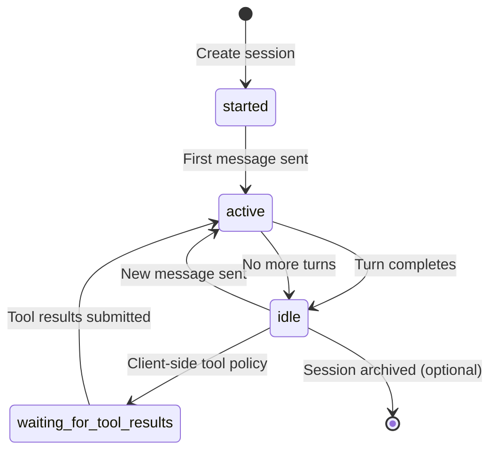
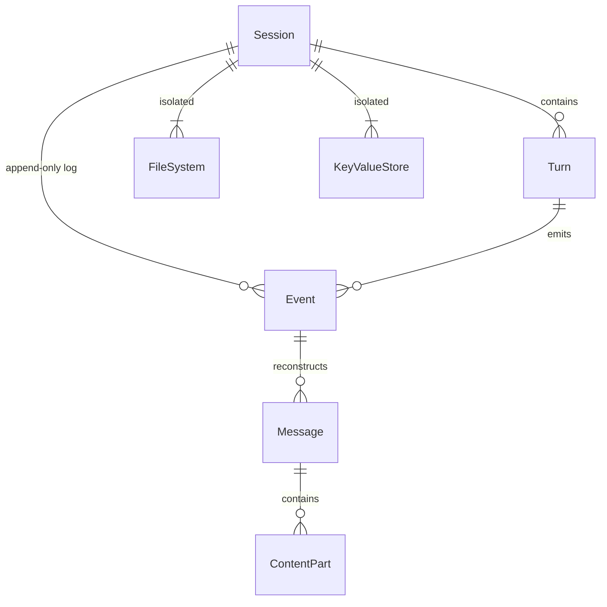
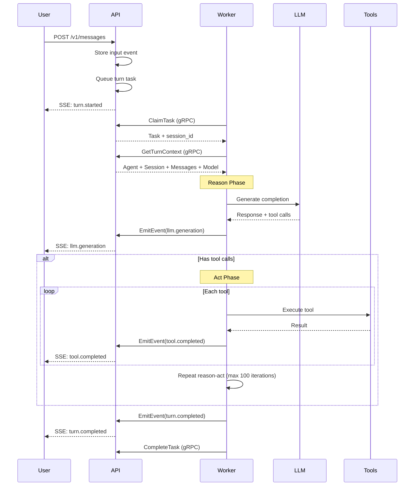

A **Session** is a working instance of an agentic loop — a single conversation with an agent. Sessions are the primary execution context where user interactions, agent responses, tool calls, and events happen.

## Concept

Sessions are **runtime instances** configured by:

- **Harness** (required, immutable) — Infrastructure and base behavior
- **Agent** (optional, switchable) — Domain-specific customization
- **Session capabilities** (optional) — Temporary capability additions
- **Model override** (optional) — Session-specific LLM model

Each session has isolated storage:

- Virtual filesystem (`/workspace`)
- Key/value storage
- Encrypted secrets
- Event log (conversation history)

<Note>
Sessions are long-lived — they don't "complete" or "fail" in the traditional sense. They transition between states as turns execute.
</Note>

## Lifecycle

### Status States



| Status | Description | Can Send Message? |
|--------|-------------|------------------|
| `started` | Session created, no turns executed yet | Yes |
| `active` | A turn is currently running | No (409 error) |
| `idle` | Turn completed, waiting for input | Yes |
| `waiting_for_tool_results` | Waiting for client to submit tool results | Only tool results |

### Creating a Session

```bash
POST /v1/sessions
```

```json
{
  "harness_id": "harness_01933b5a00007000800000000000001",
  "agent_id": "agent_01933b5a00007000800000000000002",
  "title": "Debug production issue #1234",
  "capabilities": [
    { "ref": "web_fetch" }
  ],
  "model_id": "model_01933b5a00007000800000000000003"
}
```

**Required:** `harness_id`

**Optional:** `agent_id`, `title`, `capabilities`, `model_id`

<Accordion title="Session Creation Flow">
1. **Validate harness** — Ensure harness exists and is active
2. **Validate agent** — If provided, ensure agent exists and is active
3. **Resolve capabilities** — Merge harness + agent + session capabilities
4. **Apply mounts** — Populate session filesystem from capability mount points
5. **Inject secrets** — Add user connection tokens (e.g., `GITHUB_TOKEN`)
6. **Create event log** — Initialize append-only event storage
7. **Emit session.created** — First event in the log
8. **Return session** — Status: `started`
</Accordion>

### Switching Agents

Sessions can change agents during their lifetime:

```bash
PATCH /v1/sessions/{session_id}
```

```json
{
  "agent_id": "agent_01933b5a00007000800000000000005"
}
```

The next turn will use the new agent's:

- System prompt
- Capabilities (additive to harness)
- Default model (if session doesn't override)

**Previous turns are unaffected** — they used the old agent configuration.

<Tip>
Agent switching is useful for workflows like "analyze with Agent A, then review with Agent B".
</Tip>

## Session Internals

### Turns, Messages, and Events

Sessions contain an append-only event log that drives everything:



#### Turn

One iteration of the agent loop: **reason** (call LLM) then **act** (execute tools).

- Each turn belongs to a session
- Produces events: `turn.started`, `llm.generation`, `tool.completed`, `turn.completed`
- Lifecycle: `started` → reason → act → `completed` or `failed`

See `crates/core/src/turn.rs` for the full type definition.

#### Message

A conversation entry **reconstructed from events** (not stored separately).

- Roles: `user`, `agent`, `tool_result`
- Content: array of `ContentPart` (text, image, tool_call, tool_result)
- Extended thinking: reasoning models can include extended thinking content

Messages are derived views over the event log. When you request messages, the system:

1. Queries events from the session
2. Filters by type (`input`, `llm.generation`, `tool.completed`)
3. Reconstructs messages from event payloads
4. Returns the message array

See `crates/core/src/message.rs` for the `Message` and `ContentPart` types.

#### Event

Immutable, append-only record. The primary data store.

- Types: `input`, `output`, `turn.*`, `atom.*`, `tool.*`, `llm.*`, `session.*`
- Atomic per-session sequence numbering
- Carries correlation context: `turn_id`, `input_message_id`, `exec_id`
- Cannot be updated or deleted

See `crates/core/src/events.rs` for all event types.

<Note>
**Why events instead of messages?** Events provide complete observability. You can reconstruct messages, debug execution, replay conversations, and build custom views — all from the same immutable log.
</Note>

### Virtual Filesystem

Each session has an isolated PostgreSQL-backed filesystem:

- Root: `/workspace`
- Stored in `session_files` table
- Accessible via `session_file_system` capability tools
- Shared between FileSystem and VirtualBash capabilities
- Supports readonly flag (for capability mounts)

**Example operations:**

```json
// write_file tool call
{
  "path": "/workspace/analysis.py",
  "content": "import pandas as pd\n..."
}

// bash tool call
{
  "command": "python analysis.py",
  "working_dir": "/workspace"
}
```

Files written by one tool are immediately visible to others — no sync needed.

See `crates/core/src/session_file.rs` for the `SessionFile` type.

### Key-Value Storage

Session-scoped storage with two tiers:

**Key/Value** — Plain text storage

```json
// kv_store tool call
{
  "operation": "set",
  "key": "analysis_status",
  "value": "completed"
}
```

**Secrets** — AES-256-GCM encrypted at rest

```json
// secret_store tool call
{
  "operation": "set",
  "name": "api_key",
  "value": "sk-..."
}
```

Storage is session-isolated — cannot be accessed across sessions.

Provided by the `session_storage` capability.

### User Connections

External service accounts (GitHub, GitLab) linked to the user are auto-injected as secrets:

- `GITHUB_TOKEN` — GitHub OAuth token
- `GITLAB_TOKEN` — GitLab OAuth token

Agents can use these transparently for authenticated operations (clone private repos, create issues, etc.).

See `specs/user-connections.md` for details.

## Capability Features

Sessions expose a computed `features` array based on active capabilities:

```json
{
  "id": "session_01933b5a00007000800000000000001",
  "features": [
    "file_system",
    "secrets",
    "key_value",
    "schedules"
  ]
}
```

Features are computed from:

1. Harness capabilities
2. Agent capabilities (if agent assigned)
3. Session capabilities
4. Resolved dependencies

The UI uses features to conditionally render tabs:

- `file_system` → Workspace tab
- `secrets`, `key_value` → Storage tab
- `schedules` → Schedules tab

See the [Capabilities](/concepts/capabilities) page for feature mappings.

## Turn Execution Flow



### Reason Phase (ReasonAtom)

1. Load messages from event log
2. Build RuntimeAgent from harness + agent + session config
3. Call LLM with system prompt + conversation history
4. Emit `llm.generation` event with response
5. Parse tool calls (if any)

See `crates/core/src/atoms/reason.rs`.

### Act Phase (ActAtom)

1. Execute tools in parallel (up to 10 concurrent)
2. Emit `tool.started` and `tool.completed` events
3. Handle errors with retries (tool-specific policies)
4. Collect results for next reason phase

See `crates/core/src/atoms/act.rs`.

### Max Iterations

The reason-act loop repeats until:

- LLM returns no tool calls (natural completion)
- Max iterations reached (default: 100)
- Error occurs

This prevents infinite loops.

## Advanced Features

### Message Filters

Capabilities can contribute message filters to modify retrieval:

- **Time-based filtering** — Load messages from specific time range
- **Event type filtering** — Filter by message role or event type
- **Tool name filtering** — Filter tool results by tool name
- **Ephemeral injection** — Add system reminders without persistence

See `crates/core/src/message_filter.rs` for the `MessageFilter` types.

### Infinity Context

Everruns supports unlimited conversation length via context management:

- Message filtering to keep context under model limits
- Automatic summarization (future)
- Sliding window strategies (future)

See `specs/infinity-context.md` for the full specification.

### Scheduled Tasks

Sessions can create cron-based scheduled tasks via the `session_schedule` capability:

```json
// create_schedule tool call
{
  "name": "daily_report",
  "cron_expression": "0 9 * * *",
  "user_message": "Generate daily analysis report"
}
```

Scheduled tasks automatically send messages to the session at specified times.

See `specs/scheduled-tasks.md` for details.

### SQL Databases

Sessions can have isolated SQLite databases via the `session_sql_database` capability:

```json
// sql_exec tool call
{
  "query": "CREATE TABLE users (id INTEGER PRIMARY KEY, name TEXT)"
}
```

Databases are session-scoped and stored using PostgreSQL VFS.

See `specs/session-sqldb.md` for details.

## Performance Considerations

### Event Log Growth

Long-running sessions accumulate many events:

- Events are indexed by `session_id` and `sequence_number`
- Message reconstruction is efficient (no table scans)
- Consider archiving old sessions after inactivity

### Filesystem Size

Virtual filesystems are stored in PostgreSQL:

- Files stored as `BYTEA` (binary data)
- Practical limit: ~100 MB per session
- Large files should be stored externally (S3, etc.)

### Concurrent Turns

Sessions process one turn at a time:

- Sending a message while a turn is active returns `409 Conflict`
- Check `status` field before sending messages
- Use SSE to detect `turn.completed` events

## Best Practices

### Session Organization

1. **One session per conversation** — Don't reuse sessions for unrelated tasks
2. **Meaningful titles** — Set titles to describe the session purpose
3. **Archive when done** — Sessions never auto-delete, manually archive

### Capability Selection

1. **Harness provides base** — Most capabilities should come from the harness
2. **Agent adds specialization** — Agent capabilities are domain-specific
3. **Session for experiments** — Use session capabilities for temporary additions

### Model Overrides

```json
// Session-level override (all turns)
{
  "model_id": "model_01933b5a00007000800000000000005"
}

// Message-level controls (single turn)
{
  "content": "Analyze this data",
  "controls": {
    "model_id": "model_01933b5a00007000800000000000006",
    "reasoning_effort": "high"
  }
}
```

Use message-level controls for one-off model changes, session-level for persistent overrides.

## Next Steps

<CardGroup cols={2}>
  <Card title="Events" icon="timeline" href="/concepts/events">
    Understand the event system and SSE streaming
  </Card>
  <Card title="Durable Execution" icon="rotate" href="/concepts/durable-execution">
    Learn about workflow orchestration
  </Card>
  <Card title="Create Session" icon="plus" href="/api-reference/sessions/create">
    API reference for creating sessions
  </Card>
  <Card title="Send Message" icon="message" href="/api-reference/messages/create">
    API reference for sending messages
  </Card>
</CardGroup>