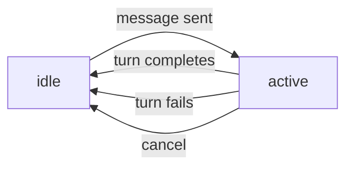

Sessions are conversational contexts where agents work. Each session maintains conversation history, file storage, and execution state. This guide covers the complete session lifecycle.

## Goal

By the end of this guide, you'll understand:
- How to create and configure sessions
- Session status lifecycle and transitions
- How to send messages and track execution
- Session-level capability configuration
- How to cancel running operations

## Session Lifecycle

Sessions move through these states:



- **idle**: Waiting for user input
- **active**: Processing a turn (reasoning and acting)

## Creating a Session

<Steps>

### Choose your harness or agent

Sessions require either:
- A **harness ID**: Defines the base environment and capabilities
- An **agent ID**: Uses the agent's configured behavior

Most use cases should specify an agent.

### Create the session

<CodeGroup>

```bash cURL
curl -X POST https://app.everruns.com/api/v1/sessions \
  -H "Authorization: Bearer YOUR_API_KEY" \
  -H "Content-Type: application/json" \
  -d '{
    "agent_id": "agt_01933b5a00007000800000000001",
    "title": "Q1 Sales Analysis",
    "tags": ["sales", "analytics"],
    "model_id": "mod_01933b5a00007000800000000042"
  }'
```

```python Python SDK
from everruns import Everruns

client = Everruns(api_key="YOUR_API_KEY")

session = client.sessions.create(
    agent_id="agt_01933b5a00007000800000000001",
    title="Q1 Sales Analysis",
    tags=["sales", "analytics"],
    model_id="mod_01933b5a00007000800000000042"  # Optional override
)

print(f"Session created: {session.id}")
```

```typescript TypeScript SDK
import { Everruns } from '@everruns/sdk';

const client = new Everruns({ apiKey: 'YOUR_API_KEY' });

const session = await client.sessions.create({
  agentId: 'agt_01933b5a00007000800000000001',
  title: 'Q1 Sales Analysis',
  tags: ['sales', 'analytics'],
  modelId: 'mod_01933b5a00007000800000000042'  // Optional override
});

console.log(`Session created: ${session.id}`);
```

```bash CLI
everruns sessions create \
  --agent agt_01933b5a00007000800000000001 \
  --title "Q1 Sales Analysis"
```

</CodeGroup>

### Session response

```json
{
  "id": "ses_01933b5a00007000800000000002",
  "organization_id": "org_01933b5a00007000800000000003",
  "agent_id": "agt_01933b5a00007000800000000001",
  "title": "Q1 Sales Analysis",
  "tags": ["sales", "analytics"],
  "model_id": "mod_01933b5a00007000800000000042",
  "status": "idle",
  "created_at": "2024-01-15T10:30:00Z",
  "updated_at": "2024-01-15T10:30:00Z"
}
```

</Steps>

## Session Configuration

### Agent ID (Required)

Specifies which agent works in this session:

```json
{
  "agent_id": "agt_01933b5a00007000800000000001"
}
```

The agent's system prompt and capabilities are used for all turns.

### Title and Tags (Optional)

Organizational metadata for filtering and display:

```json
{
  "title": "Customer Support - Ticket #1234",
  "tags": ["support", "urgent", "billing"]
}
```

List sessions by agent:

```bash
curl "https://app.everruns.com/api/v1/sessions?agent_id=agt_01933b5a" \
  -H "Authorization: Bearer YOUR_API_KEY"
```

### Model Override (Optional)

Override the agent's default model for this session:

```json
{
  "agent_id": "agt_01933b5a",
  "model_id": "mod_faster_model"  // Use a faster/cheaper model
}
```

### Session-Level Capabilities (Optional)

Add capabilities beyond what the agent has configured:

```json
{
  "agent_id": "agt_01933b5a",
  "capabilities": [
    { "ref": "web_fetch" },
    { "ref": "session_file_system", "config": { "max_file_size_mb": 10 } }
  ]
}
```

Session capabilities are **additive** to agent capabilities:
1. Agent capabilities are applied first
2. Session capabilities are merged in (no duplicates)

This allows temporarily extending an agent without modifying its base configuration.

<Warning>
Session capabilities persist for the lifetime of the session. All turns in this session will have these capabilities enabled.
</Warning>

## Sending Messages

Messages trigger agent turns. The agent reasons about the input and acts using available tools.

<CodeGroup>

```bash cURL
curl -X POST https://app.everruns.com/api/v1/sessions/ses_01933b5a/messages \
  -H "Authorization: Bearer YOUR_API_KEY" \
  -H "Content-Type: application/json" \
  -d '{
    "message": {
      "content": [
        { "type": "text", "text": "Analyze the sales data in sales.csv" }
      ]
    }
  }'
```

```python Python SDK
client.messages.create(
    session_id="ses_01933b5a",
    content="Analyze the sales data in sales.csv"
)
```

```bash CLI
everruns chat --session ses_01933b5a "Analyze the sales data in sales.csv"
```

</CodeGroup>

The session transitions to `active` status and begins processing.

### Message with Images

Attach images for vision-capable models:

```bash
# 1. Upload image
curl -X POST https://app.everruns.com/api/v1/images \
  -H "Authorization: Bearer YOUR_API_KEY" \
  -F "file=@screenshot.png" \
  -F "session_id=ses_01933b5a"

# Returns: {"id": "img_01933b5a", ...}

# 2. Send message with image reference
curl -X POST https://app.everruns.com/api/v1/sessions/ses_01933b5a/messages \
  -H "Authorization: Bearer YOUR_API_KEY" \
  -H "Content-Type: application/json" \
  -d '{
    "message": {
      "content": [
        { "type": "text", "text": "What is in this screenshot?" },
        { "type": "image_file", "image_id": "img_01933b5a", "filename": "screenshot.png" }
      ]
    }
  }'
```

### Message Controls

Control LLM generation parameters per message:

```json
{
  "message": {
    "content": [
      { "type": "text", "text": "Write a detailed analysis" }
    ],
    "controls": {
      "max_tokens": 2000,
      "temperature": 0.7
    }
  }
}
```

## Tracking Execution

Use Server-Sent Events (SSE) to stream real-time updates as the agent works.

### Connecting to SSE

```javascript
const eventSource = new EventSource(
  'https://app.everruns.com/api/v1/sessions/ses_01933b5a/sse',
  { headers: { 'Authorization': 'Bearer YOUR_API_KEY' } }
);

eventSource.addEventListener('output.message.delta', (event) => {
  const data = JSON.parse(event.data);
  console.log('Agent text:', data.data.delta);
});

eventSource.addEventListener('turn.completed', (event) => {
  console.log('Turn finished');
  eventSource.close();
});
```

### Key Events

| Event | Description |
|-------|-------------|
| `input.message` | User message received |
| `turn.started` | Turn execution began |
| `reason.started` | Agent is thinking (LLM call) |
| `output.message.started` | Agent response started |
| `output.message.delta` | Streaming text update |
| `output.message.completed` | Agent response finished |
| `tool.started` | Tool execution began |
| `tool.completed` | Tool execution finished |
| `turn.completed` | Turn finished successfully |
| `turn.failed` | Turn failed with error |
| `session.idled` | Session returned to idle |

See [Streaming Events Guide](/guides/streaming-events) for detailed event documentation.

### Resuming from Last Event

Use `since_id` to resume after disconnection:

```bash
curl "https://app.everruns.com/api/v1/sessions/ses_01933b5a/sse?since_id=evt_01933b5a" \
  -H "Authorization: Bearer YOUR_API_KEY"
```

Only events after the specified ID will be streamed.

### Event Filtering

Filter events by type:

```bash
# Only turn lifecycle events
curl "https://app.everruns.com/api/v1/sessions/ses_01933b5a/sse?types=turn.started&types=turn.completed" \
  -H "Authorization: Bearer YOUR_API_KEY"

# Everything except streaming deltas
curl "https://app.everruns.com/api/v1/sessions/ses_01933b5a/sse?exclude=output.message.delta&exclude=reason.thinking.delta" \
  -H "Authorization: Bearer YOUR_API_KEY"
```

## Cancelling Operations

Cancel the currently executing turn:

<CodeGroup>

```bash cURL
curl -X POST https://app.everruns.com/api/v1/sessions/ses_01933b5a/cancel \
  -H "Authorization: Bearer YOUR_API_KEY"
```

```python Python SDK
client.sessions.cancel_turn("ses_01933b5a")
```

</CodeGroup>

### Cancellation Flow

1. API emits `turn.cancelled` event immediately
2. API emits `input.message` with "User requested to cancel the work."
3. Worker detects cancellation and stops execution
4. Worker emits `output.message.completed` with "Work was cancelled by user."
5. Worker emits `session.idled` event
6. Session returns to `idle` status

<Warning>
Cancellation is not instantaneous. In-flight LLM calls or tool executions may complete before the worker stops.
</Warning>

## Session Filesystem

Each session has a virtual filesystem for storing files:

```bash
# List files
curl https://app.everruns.com/api/v1/sessions/ses_01933b5a/fs \
  -H "Authorization: Bearer YOUR_API_KEY"

# Upload file
curl -X POST https://app.everruns.com/api/v1/sessions/ses_01933b5a/fs/data.csv \
  -H "Authorization: Bearer YOUR_API_KEY" \
  -H "Content-Type: text/csv" \
  --data-binary @data.csv

# Read file
curl https://app.everruns.com/api/v1/sessions/ses_01933b5a/fs/data.csv \
  -H "Authorization: Bearer YOUR_API_KEY"

# Delete file
curl -X DELETE https://app.everruns.com/api/v1/sessions/ses_01933b5a/fs/data.csv \
  -H "Authorization: Bearer YOUR_API_KEY"
```

Agents with the `session_file_system` capability can read, write, and manipulate these files.

See the [Session Filesystem API reference](/api-reference/session-filesystem) for operations like move, copy, grep, and stat.

## Managing Sessions

### List Sessions

<CodeGroup>

```bash cURL
curl "https://app.everruns.com/api/v1/sessions?offset=0&limit=20" \
  -H "Authorization: Bearer YOUR_API_KEY"
```

```bash CLI
everruns sessions list
```

</CodeGroup>

Supports pagination with `offset` and `limit` parameters (default limit: 20, max: 100).

### Get Session Details

<CodeGroup>

```bash cURL
curl https://app.everruns.com/api/v1/sessions/ses_01933b5a \
  -H "Authorization: Bearer YOUR_API_KEY"
```

```bash CLI
everruns sessions get ses_01933b5a
```

</CodeGroup>

### Update Session

Update title or tags:

```bash
curl -X PATCH https://app.everruns.com/api/v1/sessions/ses_01933b5a \
  -H "Authorization: Bearer YOUR_API_KEY" \
  -H "Content-Type: application/json" \
  -d '{
    "title": "Q1 Sales Analysis - Complete",
    "tags": ["sales", "analytics", "completed"]
  }'
```

### Delete Session

Permanently delete a session and all associated data:

```bash
curl -X DELETE https://app.everruns.com/api/v1/sessions/ses_01933b5a \
  -H "Authorization: Bearer YOUR_API_KEY"
```

<Warning>
Deletion is permanent. All conversation history, files, and events are removed.
</Warning>

## Global Chat Session

Get or create a singleton global chat session for the current user:

```bash
curl -X POST https://app.everruns.com/api/v1/sessions/chat \
  -H "Authorization: Bearer YOUR_API_KEY"
```

This endpoint:
- Returns the user's existing global chat session if one exists
- Creates a new session with the Platform Chat harness if none exists
- Uses tags (`global-chat` + `user:{user_id}`) for singleton management

Useful for building chat UIs where users have a single persistent conversation.

## Common Patterns

### Multi-Turn Conversation

```python
session = client.sessions.create(
    agent_id="agt_support",
    title="Customer Issue #4567"
)

# Turn 1
client.messages.create(
    session_id=session.id,
    content="User reports login issues"
)
# Wait for turn.completed event

# Turn 2
client.messages.create(
    session_id=session.id,
    content="Checked logs, found rate limiting. Fixed."
)
# Wait for turn.completed event

# Turn 3
client.messages.create(
    session_id=session.id,
    content="Summarize the resolution"
)
```

### Long-Running Analysis

```python
# Create session with filesystem capability
session = client.sessions.create(
    agent_id="agt_analyst",
    capabilities=[{"ref": "session_file_system"}]
)

# Upload dataset
client.session_fs.upload(session.id, "sales.csv", csv_data)

# Start analysis
client.messages.create(
    session_id=session.id,
    content="Analyze sales.csv and create a report in report.md"
)

# Stream progress
for event in client.events.stream(session.id):
    if event.type == "tool.completed":
        print(f"Tool: {event.data.tool_name}")
    elif event.type == "turn.completed":
        break

# Download report
report = client.session_fs.read(session.id, "report.md")
print(report)
```

## Common Pitfalls

<Warning>
**Concurrent Turns**: Sessions can only process one turn at a time. Sending a message while `status=active` will fail with `400 Bad Request`.

Wait for `turn.completed` or `turn.failed` before sending the next message.
</Warning>

<Warning>
**Agent ID Required**: Sessions require either `agent_id` or `harness_id`. Missing both returns `400 Bad Request`.
</Warning>

<Warning>
**SSE Connection Cycling**: SSE connections are automatically cycled every 5 minutes to prevent stale connections. Use the SDK which handles `disconnecting` events and reconnects with `since_id` transparently.
</Warning>

<Warning>
**Model Override Validation**: The `model_id` must reference a valid LLM model configured in your organization. Invalid IDs return `404 Not Found`.
</Warning>

## Next Steps

- [Send messages and stream responses](/guides/streaming-events)
- [Use the session filesystem](/api-reference/session-filesystem)
- [Learn about agent capabilities](/guides/adding-capabilities)
- [Explore session events](/api-reference/events)
