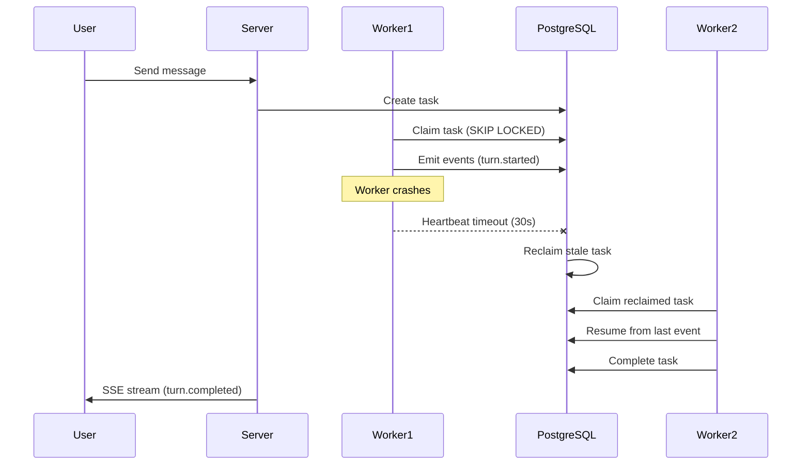
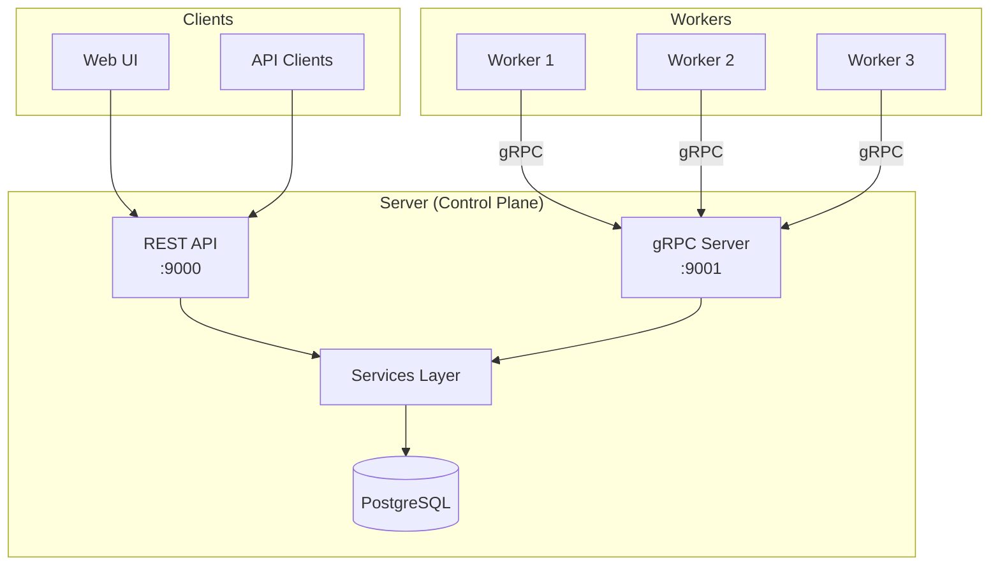

## What is Everruns?

Everruns is a **headless durable agentic harness engine** that runs AI agents in the most reliable way possible. Every step and tool call in an agent run is persisted using a PostgreSQL-backed durable execution engine, ensuring your agents survive restarts, failures, and infrastructure changes.

Unlike traditional agent frameworks that focus on development abstractions, Everruns is a **production-grade service** designed for running agents reliably at scale. It provides the runtime infrastructure—durable execution, streaming observability, multi-provider LLM support, and modular capabilities—so you can focus on building agent behaviors.

<CardGroup cols={2}>
  <Card title="Quickstart" icon="rocket" href="/quickstart">
    Get Everruns running with Docker Compose in minutes
  </Card>
  <Card title="API Reference" icon="code" href="/api/overview">
    Explore the REST API for agents, sessions, and messaging
  </Card>
  <Card title="Key Concepts" icon="book" href="/concepts/overview">
    Understand harnesses, agents, sessions, and capabilities
  </Card>
  <Card title="Capabilities" icon="puzzle-piece" href="/concepts/capabilities">
    Extend agent functionality with modular capabilities
  </Card>
</CardGroup>

## Key Features

### Durable Execution

Agent sessions survive restarts via PostgreSQL-backed workflows. Every turn, tool call, and LLM response is persisted as an event. When a worker crashes mid-execution, the task is automatically reclaimed and resumed by another worker—no lost work, no duplicate tool calls.



The durable execution engine handles:
- Automatic retries with exponential backoff
- Circuit breakers to prevent cascading failures
- Task ownership verification to prevent duplicate work
- Heartbeat-based liveness detection

### Streaming Events

Real-time SSE (Server-Sent Events) streaming of agent responses, tool calls, and execution state. Every event is persisted to the database before streaming, providing both real-time feedback and historical replay.

```bash
curl -N http://localhost:9300/api/v1/sessions/{session_id}/events/stream
```

Example event stream:
```json
{"type":"turn.started","ts":"2024-01-15T10:30:00.000Z","data":{"turn_id":"..."}}
{"type":"reason.started","data":{"model":"gpt-4o"}}
{"type":"llm.generation","data":{"content":[{"type":"text","text":"I'll help..."}]}}
{"type":"tool.started","data":{"tool_name":"web_fetch","parameters":{"url":"..."}}}
{"type":"tool.completed","data":{"result":"..."}}
{"type":"turn.completed","data":{"status":"completed"}}
```

### Management UI

Next.js dashboard for managing agents, sessions, and conversations. Monitor execution, view message history, inspect tool calls, and configure capabilities—all in a clean, responsive interface.

Access the UI at `http://localhost:9300` after deployment.

### Extensible Capabilities

Add tools and behaviors to agents via modular capabilities. Capabilities contribute:
- **System prompt additions** - Instructions and context for the agent
- **Tools** - Functions the agent can invoke
- **Mount points** - Files and directories in the session filesystem

```json
{
  "capabilities": [
    { "ref": "session_file_system" },
    { "ref": "virtual_bash" },
    { "ref": "web_fetch" },
    { "ref": "mcp:01933b5a-0000-7000-8000-000000000501" }
  ]
}
```

Built-in capabilities include file system access, bash execution, web fetching, key/value storage, encrypted secrets, and more. MCP (Model Context Protocol) servers are integrated as virtual capabilities, allowing agents to use external tools.

### Multi-Provider Support

Unified LLM interface supporting OpenAI, Anthropic, and other providers. Switch models without changing code. Configure default models per agent or override at the session/message level.

Supported providers:
- **OpenAI** - GPT-4o, GPT-4o mini, o1, o1-mini, o3-mini
- **Anthropic** - Claude Sonnet 4, Claude Opus 4, Haiku 4
- **Google** - Gemini models
- **llmsim** - Simulated LLM for testing

### Open Responses Protocol

Everruns implements the [Open Responses specification](https://www.openresponses.org/)—a vendor-neutral, open-source API standard for multi-provider LLM interfaces.

Key benefits:
- **One spec, many providers** - Same API works with OpenAI, Anthropic, Gemini, and local models
- **Better caching** - 40-80% better cache utilization vs Chat Completions API
- **Agentic loop support** - Native tool calls, state machines, and semantic streaming events
- **Provider-agnostic** - Events and responses follow a standardized format

Learn more at [openresponses.org](https://www.openresponses.org/).

### PostgreSQL-Backed Storage

All state—agents, sessions, messages, events, workflows—is stored in PostgreSQL 17. No additional infrastructure required. The database provides:
- **ACID transactions** for consistency
- **UUID v7 primary keys** for time-ordered indexing
- **JSONB columns** for flexible schema
- **NOTIFY/LISTEN** for push-based task distribution

Run in development mode (DEV_MODE) with in-memory storage for rapid iteration without database setup.

### Observability

OpenTelemetry integration with Gen-AI semantic conventions. Export traces to Jaeger (included in Docker Compose) or any OTLP-compatible backend (Braintrust, Datadog, Honeycomb).

The metrics dashboard provides real-time visibility:
- Workflow and task status (running, pending, completed, failed)
- Throughput (tasks/sec)
- System load and worker health
- Dead letter queue size

## Architecture

Everruns follows a distributed architecture with separate control plane and workers:



**Control Plane** (Server):
- HTTP API (port 9000) for client requests
- gRPC server (port 9001) for worker communication
- PostgreSQL for state persistence
- SSE streaming for real-time events

**Workers**:
- Stateless task executors
- Communicate with control plane via gRPC only
- No direct database access
- Scale horizontally for throughput

**Benefits**:
- Clear separation between control plane (owns state) and workers (stateless executors)
- Workers don't need database credentials or encryption keys
- Simplified worker deployment and scaling

## Core Concepts

### Harness

Top-level entity defining infrastructure, defaults, and constraints for session execution. Configures how agents are invoked, default capabilities, and the execution environment.

### Agent

Domain-specific or task-specific configuration for the agentic loop. Defines system prompt, default LLM model, and enabled capabilities. Agents are assigned to sessions.

### Session

Working instance of an agentic loop. Primary execution context where conversations happen. Each session has:
- Assigned harness (required)
- Optional agent (can change over session lifetime)
- Isolated filesystem (`/workspace`)
- Key/value storage and encrypted secrets
- Message history (reconstructed from events)

### Turn

One iteration of the agent loop: **reason** (call the LLM) then **act** (execute tools). Turns emit events for observability and durability.

### Capability

Modular functionality unit extending agent behavior. Contributes system prompt additions, tools, and mount points. Can be attached to harnesses, agents, or sessions.

### Tool

A function the agent can invoke during execution. Tools are provided by capabilities. Built-in tools have no prefix; MCP tools use `mcp_{server}__{tool}` format.

### Event

Immutable, append-only record in the event log. Types include input, output, turn lifecycle, LLM generation, tool execution, and more. Events power SSE streaming and message reconstruction.

## Use Cases

<CardGroup cols={2}>
  <Card title="Research Agents" icon="magnifying-glass">
    Multi-step research with web search, content fetching, and synthesis across multiple turns
  </Card>
  <Card title="DevOps Automation" icon="server">
    Infrastructure management with bash execution, Docker containers, and cloud sandbox integration
  </Card>
  <Card title="Customer Support" icon="headset">
    Context-aware support with access to knowledge bases, ticketing systems (via MCP), and file storage
  </Card>
  <Card title="Data Analysis" icon="chart-line">
    Analyze datasets with session-scoped SQL databases, Python execution, and visualization generation
  </Card>
</CardGroup>

## Next Steps

<Steps>
  <Step title="Quickstart">
    Deploy Everruns with Docker Compose and create your first agent
    
    [Go to Quickstart →](/quickstart)
  </Step>
  
  <Step title="Explore Capabilities">
    Learn about built-in capabilities like file system, bash, web fetch, and MCP integration
    
    [View Capabilities →](/concepts/capabilities)
  </Step>
  
  <Step title="Build with the API">
    Create agents programmatically and integrate Everruns into your applications
    
    [API Reference →](/api/overview)
  </Step>
</Steps>
